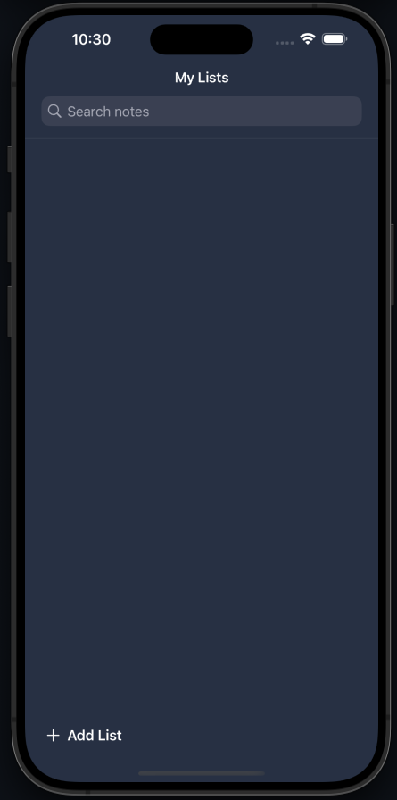
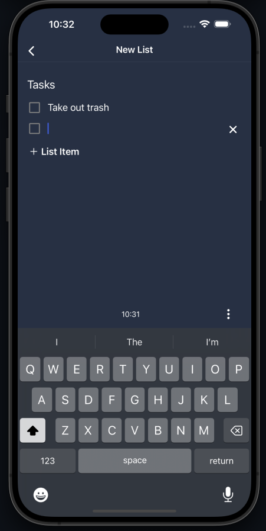
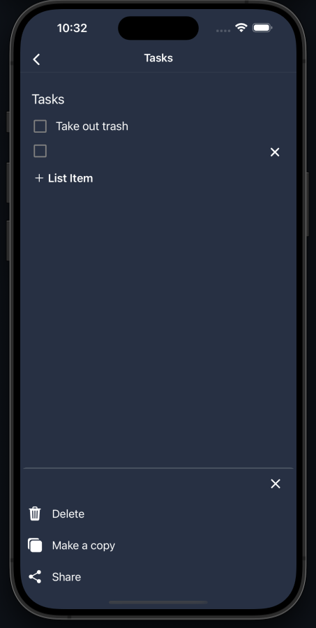

# Listly

Listly is a sleek and intuitive list app inspired by the simplicity of Google Keep. Users can create, manage, and organize tasks effortlessly, with all data stored securely on their device. Designed with a clean, minimalistic interface for a smooth user experience.

---

## Features

- 📋 Create and manage lists or notes seamlessly
- 💾 Offline functionality with on-device storage
- 🎨 Modern and responsive design
- ✅ Simple, clean, and minimalistic interface

---

## Tech Stack

- **Frontend:** [React Native / React / Expo Router]
- **Local Storage:** [AsyncStorage]

---

## Installation

Follow these steps to run Listly on your local machine:

1. Clone the repository:

   ```bash
   git clone https://github.com/MohammedRiazKhan/Listly.git
   ```

2. Navigate to the project directory:

   ```bash
   cd Listly
   ```

3. Install dependencies:

   ```bash
   npm install
   ```

4. Start the app:
   ```bash
   npx expo start
   ```

## Screenshots

### Lists Screen



### New List Screen



### View/Edit List Screen



## Purpose

This project demonstrates my ability to design and develop an offline-first application with a focus on usability, performance, and aesthetics.

## License

This project is licensed under the GNU GENERAL PUBLIC LICENSE V3.

## Contributing

Contributions are welcome! Please open an issue or submit a pull request for any improvements or bug fixes.
